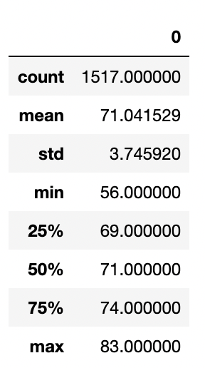

# Readme.md: surfs_up
# Overview of the analysis
The purpose of this analysis is to find out if the island of Oahu would be a good place to open an ice cream shop. The first part focused on precipiation, and this additional challenge focuses on temperatures in the months of June and December. By looking at these sample months, we hope to answer the question: Does it remain temperate enough for ice cream on Oahu year round?

# Results: Provide a bulleted list with three major points from the two analysis deliverables. Use images as support where needed.
Our findings are below.
## June

## December

Here are some insights:
- The min temps are 64 and 56
- The max temps are 85 and 83
- The mean temps are 74 and 71

# Summary: Provide a high-level summary of the results and two additional queries that you would perform to gather more weather data for June and December.

Our results clearly show that as far as the temperatures go, opening an ice cream shop in Oahu is an excellent idea. It doesn't get too cold for ice cream (although one could argue it's never too cold for ice cream!) The mild and sunny weather make it a perfect place to start our new business. In the future, we would query for two other places to open ice cream shops in Hawaii. How is the weather in Maui or Kauai? Opportunity for expansion is everywhere, as long as this location does well - and the data says it will!